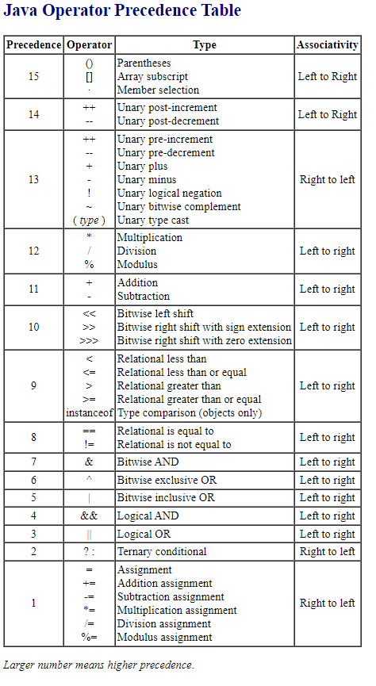

# Notes

<div align="center">

</div> 

``` java    
public class Test {
    public static void main(String [] args) {
        byte var = 127;
        System.out.println(/*INSERT*/);
    }   
}
```
Range of byte data type is from -128 to 127.


var = var - 1: 'var - 1' results in int type and it cannot be assigned to byte type without explicit casting, hence it causes compilation error.

var = var + 1: 'var + 1' results in int type and it cannot be assigned to byte type without explicit casting, hence it causes compilation error.

> Please note that implicit casting is added by the compiler for prefix, postfix and compound assignment operators.

++var: Compiler converts it to var = (byte) (var + 1) and hence it compiles successfully.

--var: Compiler converts it to var = (byte) (var - 1) and hence it compiles successfully.

var *= 2: Compiler converts it to var = (byte) (var * 2) and hence it compiles successfully.

var -= 10: Compiler converts it to var = (byte) (var - 10) and hence it compiles successfully.

var += 2: Compiler converts it to var = (byte) (var + 2) and hence it compiles successfully.

var: No issues at all, it also compiles successfully.

***

``` java
public class Test {
    public static void main(String [] args) {
        boolean status = true;
        System.out.println(status = false || status = true | status = false);
        System.out.println(status);
    }
}
```

> System.out.println(status = false || status = (true | status) = false); //Bitwise inclusive OR | has highest precedence over logical or || and assignment =


``` java
public class Test {
    public static void main(String [] args) {
        var a = 3; //Line n1
        var b = 5; //Line n2
        var c = 7; //Line n3
        var d = 9; //Line n4
        boolean res = --a + --b < 1 && c++ + d++ > 1;
        System.out.printf("a = %d, b = %d, c = %d, d = %d, res = %b", a, b, c, d, res);
    }
}

```

> --a + --b < 1 && c++ + d++ > 1; \
--a + --b < 1 && (c++) + (d++) > 1; //postfix has got highest precedence \
(--a) + (--b) < 1 && (c++) + (d++) > 1; //prefix comes after postfix \
{(--a) + (--b)} < 1 && {(c++) + (d++)} > 1; //Then comes binary +. Though parentheses are used but I used curly brackets, just to explain. \
[{(--a) + (--b)} < 1] && [{(c++) + (d++)} > 1]; //Then comes relational operator (<,>). I used square brackets instead of parentheses. \
This expression is left with just one operator, && and this operator is a binary operator so works with 2 operands, left operand [{(--a) + (--b)} < 1] and right operand [{(c++) + (d++)} > 1] \
Left operand of && must be evaluated first, which means [{(--a) + (--b)} < 1] must be evaluated first. \


[{2 + (--b)} < 1] && [{(c++) + (d++)} > 1]; //a=2, b=5, c=7, d=9 \

[{2 + 4} < 1] && [{(c++) + (d++)} > 1]; //a=2, b=4, c=7, d=9 \

[6 < 1] && [{(c++) + (d++)} > 1]; \

false && [{(c++) + (d++)} > 1]; \


> && is short circuit operator, hence right operand is not evaluated and false is returned.


Output of the given program is: a = 2, b = 4, c = 7, d = 9, res = false

***

``` java
public class Main {
    public static void main(String [] args) {
        String text = null;
        text = text + new A(); //Line n1
        System.out.println(text.length()); //Line n2
    }


}
class A {
    public String toString() {
        return null;
    }
}
```

> 8
